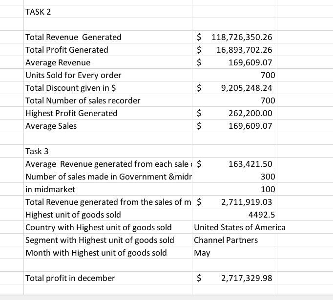

# Data_Analysis_Bootcamp 
## INTRODUCTION
In the ongoing bootcamp we were thought basic excel functions after which a task was assigned.This involves creating a table with 20 rows and 5 column. The table has the following headers, Employee ID, Employee full name, Job type, salary and Department.
## TASK
1.  To show employee who are freelancers and highlight one whose salary is above $10000.
2.  split the employee full name in "first name" and "last name and check for duplicates and highlight if any.
3.  Highliht any employee whose name begins with the letter "E" and Format the Column to show Highest salary in green and lowest in red backgroud respectively.
  ## SKILLS ADOPTED
- Conditional Formatting
- Filtering
- Test-to- column
- ## DATA
  To carry out the tasks above, filter function was applied acrosss the header to indicate employee working as freelancers and those whose salary is above $10000.

For the second question,the employee full names was splited into First and last names using the **text-to-Column** function and using **conditional formatting** to highlite duplicates.

for last task, conditional formatting was used to highlite employees names with has the letter **E** in Yellow and indicate highesst salary earner in green and lowest in red respectively.

In the scond session of the bootcamp we discussed **functions and formulas**
and their various syntax. The formula discussed are 
- sum,
- average
- count
- min
- max
- concatenate
- date 
- left
- right.

## USING THE FUNCTIONS AND FORMULAS
The function and formulas were used in calculuating the following.

_NOTE_:  The data set was provided

1. Total Revenue and Profit Generated
2. average Revenue and Units sold for every order
3. Total discount given in $
4. Numbers of sales recorded
5. Highest profit generated
6. Create a column named "sales range" return "High sales" if the value is above average otherwise return "low sales".
   
## SKILLS CONCEPT ADOPTED
Answering the questions above  involves manipulating and combining multiple formulas and functions and syntax.

for instance in question 1

 **Sum Function** was used on the sales column and Profit column.
 
 for question 2
 
 **Average Function** used after deriving in the total revenue in question 1.
 
 for Qestion 3

 **Sum Function** was explore on the discount column with specified range

 For Question 4

 **Count Function** was adopted on the sales record column

 Question 5

 **Max Function** was used on Profit column
 
 for Question 6

**Sales Range** Column was created and averaged of the sales calculated and the "IF" function deplored.

 
 In the third session of the class we talked about **advanced function and condition** which are more complex and usually use for indepth data analysis. some of the functions.
 
 - SumIF and SumIFS
 - AverageIF and AverageIFS
 - CountIF and CountIFS
 - Vlookup
 - Xlookup
 - Hlookup

   ## TASK GIVEN
   we were asked to calculate the following below using the advance function and condition.
   1. Average Revenue generated from each sales of paseo.
   2. Number of slaes made in government and Midmarket.
   3. Total revenue generated from the sales of montana in canada
   4. In which country was the highest unit of good sold.
   5. what is the total profit made in december.

   ## SKILLS USED
   For question 1.

   "AverageIF" was used with "paseo" as the criteria and sales rang indicated.

   Question 2.

   "Countif" was used to calculate sales in government and midmartket seperately and was later sum up.
   
    Question 3.

    "SumIFS" concept was explored with "montana and canada" as the special criteria with reference to sales and country columns.

   Question 4

   "Vlookup Function"  was the appropriate function

   Question 5

   "SumIFS" is the function because it has criteria "December"

   

   

## CONCLUSION
It has been an exciting seession, knowing the basics,advance functions and formulars of excel for data analysis is great and looking forward to learn more as the bootcamp advance.
   

  
